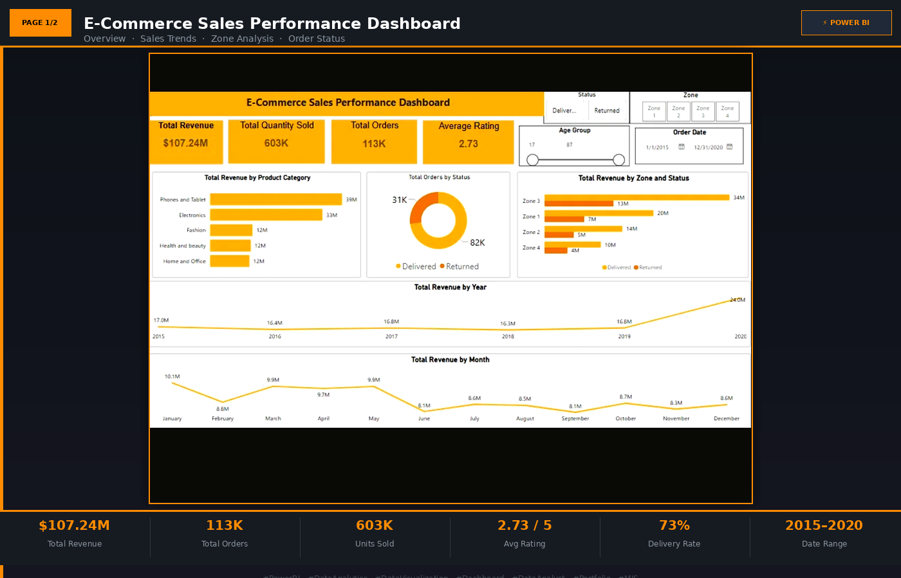
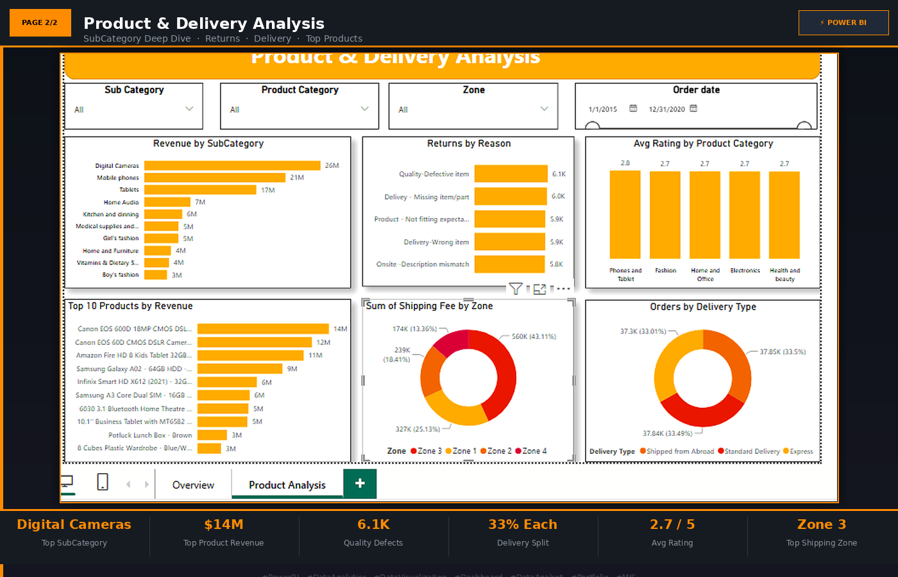

# 📊 E-Commerce Sales Dashboard | Power BI

Interactive 2-page Power BI dashboard analyzing e-commerce sales, product performance & KPIs

## 🎯 Objective
To design a recruiter-facing, decision-ready dashboard that turns raw e-commerce 
transaction data into actionable business insights — covering overall sales health 
(Page 1) and deep product-level analysis (Page 2).

## 🖼️ Dashboard Preview

### Page 1: Overview

### Page 2: Product Analysis

## 🔑 Key Features
- KPI cards for Total Sales, Orders, AOV, and Profit Margin
- Interactive slicers for Date, Category, and Region
- Custom DAX measures for YoY growth, running totals, and category contribution
- Orange-themed, clutter-free visual design for quick executive scanning

## 🛠️ Tools Used
- Power BI Desktop
- DAX (Data Analysis Expressions)
- Power Query for data cleaning/transformation

## 📈 Key Insights
*Phones & Tablets and Electronics drove the business, contributing $39M and $33M in revenue respectively — together over 65% of the $107.24M total revenue
*Digital Cameras was the single top-performing subcategory at $26M, with the Canon EOS 600D alone generating $14M — signaling a clear opportunity to double down on high-ticket electronics
*2020 revenue jumped to $24M, a sharp rebound after five years of relatively flat performance ($16-17M/year from 2015-2019)
*Returns remain a key risk area: ~31K of 113K orders (27%) were returned, with product quality defects (6.1K cases) the leading cause — closely followed by delivery/fulfillment issues (missing items, wrong items)
*Delivery is evenly split across Shipped from Abroad, Standard, and Express (~33% each), while Zone 3 carries the highest shipping cost burden at 43% of total shipping fees
*Average customer rating sits at 2.73/5, suggesting a meaningful gap between sales volume and customer satisfaction worth investigating further

## 🔗 Connect
linkedin.com/in/himanshu-chouhan-2b84b420b
